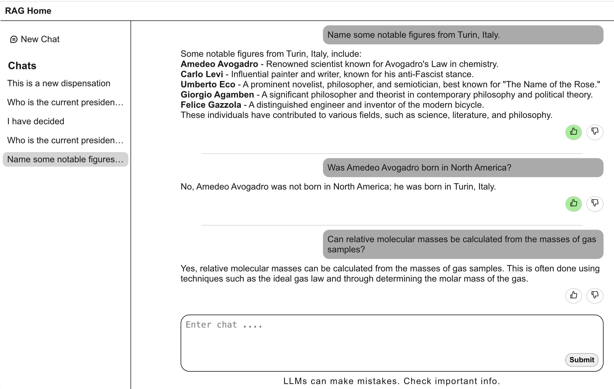
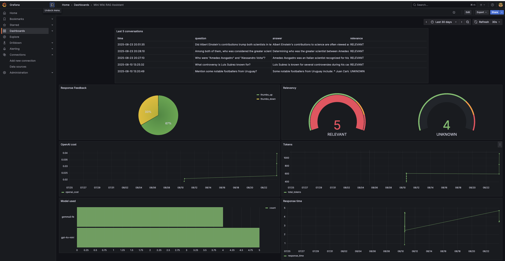

Monitoring was primarily applied in the capstone project. Check out the repo for additional 
details. Monitoring dashboards used grafana with docker for a mini-wiki RAG implementation 
[capstone link](https://github.com/Josesx506/llmzoomcamp-capstone). 

### Interface
The app interface is built with a mixture of a fastapi backend api service, and a Next.js frontend 
service. 

<div align="center">
  <br>
  <span>UI Interface</span>
</div>
<br>

Conversation history from most recent 3 messages in a conversation is also passed to the prompt to 
maintain context for a conversation style experience. This is a ***sliding window*** approach where 
the oldest message is replaced for historical context. Without this, each query starts with a new 
state and can't follow logic from previous messages. Longer conversation histories consumes tokens 
faster.

### Monitoring
Monitoring dashboard implemented with Grafana. To access the grafana dashboard from the local docker 
network, navigate to http://localhost:3500/ in your browser. The dashboard is not implemented on my 
production server because it gives access to my db.
```json
{
  "username": "admin",
  "password": "12345"
}
```
<div align="center">
  <br>
  <span>Grafana Dashboard display</span>
</div>
